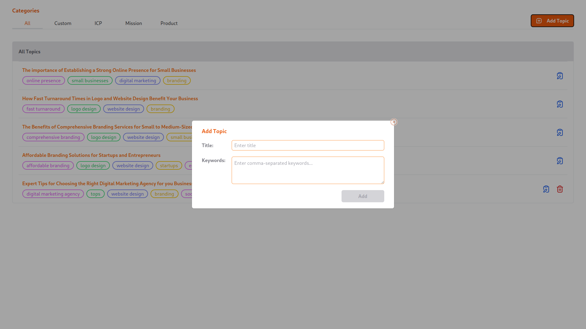

# SpeedyBrand Assignment

#### A user can
- switch between categories to view different sets of Topics
- filter topics by pressing on the keywords listed under each topic (filtered keywords appear on top-right, also from where users can cancel those filter/s)
- delete a certain topic by using the Trash icon (restricted to Custom topics only, as of now)
- add a new topic by providing a topic title and a set of keywords (comma-separated values) in the modal form that pops out when "Add Topic" button is pressed.
- generate a Blog's content on a particular topic using the Write (Leafpad with pen) icon and selecting a Tone from the dropdown presented in the modal form.
- edit and format the content generated using the embedded text-editor
- insert various other elements inside the text-editor. For the assignment, a user can add an image, resize it after pressing on it and can align it (left, center, right).

## Tech-stack

- Python:       ^3.10.0
- Flask:        ^2.3.0
- MongoDB:      ^4.3.0
- Node:         ^19.7.0
- React:        ^18.2.0
- TailwindCSS:  ^3.3.2

P.S. Demo URL is available in the description.

## Screengrabs

